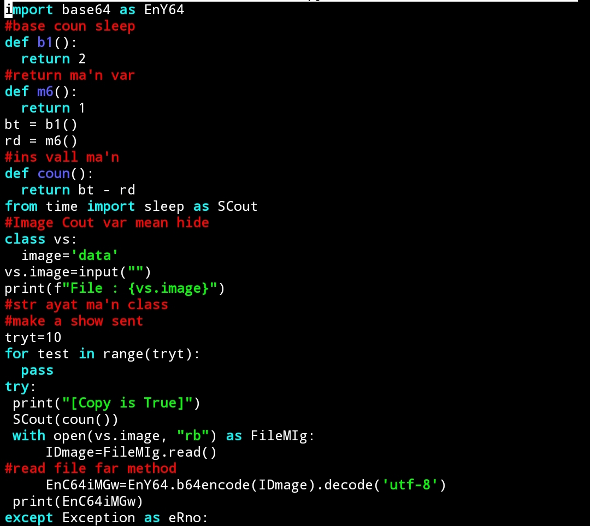

# USAGE
```shell
git clone https://github.com/mika259/CryptMage
```
- or just download it as zip at the button on this github page.
- Linux/Termux/Ubuntu/Windows10,7,8,9.
- Just type at the terminal with a simple command.<br>
- Make sure you already installed python version 3 in your computer.



# Open Folder File
```bash
cd CryptMage
```

\\ this next step you're pro right
# Quick Command
```bash
python3 cr.py
```

- then enter your file name when it freeze, because input is not using a text just blank input i was made it. Just keep insert your image name file.
- And wait the result output.
- copy and use.

# Save In File for other use
```bash
python3 cr.py > output.txt
```

- in this command, output will be saved in output.txt
